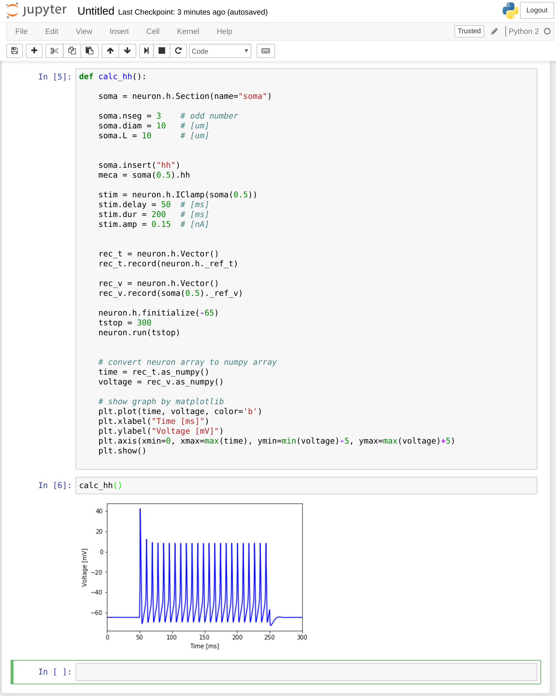

docker-neuron
---

[](https://travis-ci.org/DaisukeMiyamoto/docker-neuron)

docker containers for NEURON simulator

# Basic Usage

## run NERUON GCC+OpenMPI+Python version

```
$ docker run -it dmiyamoto/neuron:gcc-ompi
```


- you could run python with neuron in docker image

```
$ python
Python 2.7.12 (default, Nov 19 2016, 06:48:10)
[GCC 5.4.0 20160609] on linux2
Type "help", "copyright", "credits" or "license" for more information.
>>> import neuron
NEURON -- Release 7.4 (1370:16a7055d4a86) 2015-11-09
Duke, Yale, and the BlueBrain Project -- Copyright 1984-2015
See http://www.neuron.yale.edu/neuron/credits

>>>
```

## run built-in benchmark of the multi compartment hodgkin-huxley model

- single core condition

    ```
    $ docker run dmiyamoto/neuron:bench ./run.sh
    ```

- many core condition
  - 2 core

    ```
    $ docker run dmiyamoto/neuron:bench ./run.sh 2
    ```

  - 4 core

    ```
    $ docker run dmiyamoto/neuron:bench ./run.sh 4
    ```


## run NEURON with Jupyter Notebook

- run docker image

```
$ docker run -p 8888:8888 dmiyamoto/neuron:jupyter
/usr/local/lib/python2.7/dist-packages/IPython/paths.py:69: UserWarning: IPython parent '/home/neuron' is not a writable location, using a temp directory.
  " using a temp directory.".format(parent))
[I 14:20:39.322 NotebookApp] Writing notebook server cookie secret to /home/neuron/.local/share/jupyter/runtime/notebook_cookie_secret
[W 14:20:39.331 NotebookApp] WARNING: The notebook server is listening on all IP addresses and not using encryption. This is not recommended.
[I 14:20:39.335 NotebookApp] Serving notebooks from local directory: /work
[I 14:20:39.336 NotebookApp] 0 active kernels 
[I 14:20:39.336 NotebookApp] The Jupyter Notebook is running at: http://[all ip addresses on your system]:8888/?token=4683????????????????????????????
[I 14:20:39.336 NotebookApp] Use Control-C to stop this server and shut down all kernels (twice to skip confirmation).
[C 14:20:39.336 NotebookApp] 
    
    Copy/paste this URL into your browser when you connect for the first time,
    to login with a token:
        http://localhost:8888/?token=4683????????????????????????????????
```

- Access to the printed URL by a browser




## run NEURON dpkg distributed version

```
$ docker run -it dmiyamoto/neuron:dpkg
```


# Reference
- https://hub.docker.com/r/dmiyamoto/neuron/
- http://neuron.yale.edu

